# Отчет по практической работе №1
## Студент: [Чеглаков Максм Витальевич]
## Группа: [БСБО-16-23]
## Дата выполнения: [29.04.2026]
### 1. Выполненные команды Docker
#### 1.1 Работа с образами
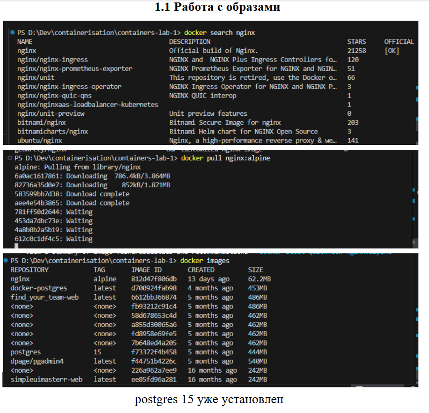
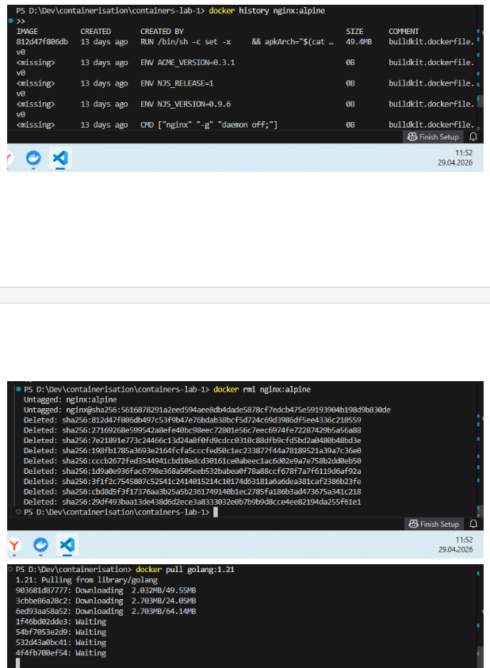
#### 1.2 Работа с контейнерами
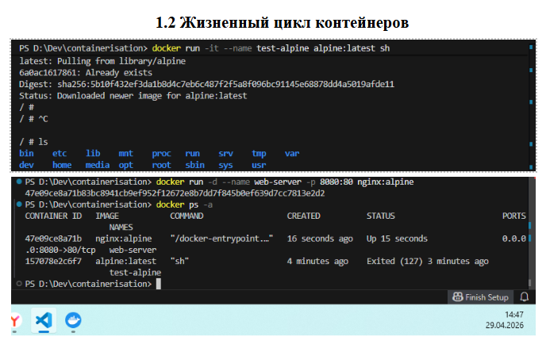
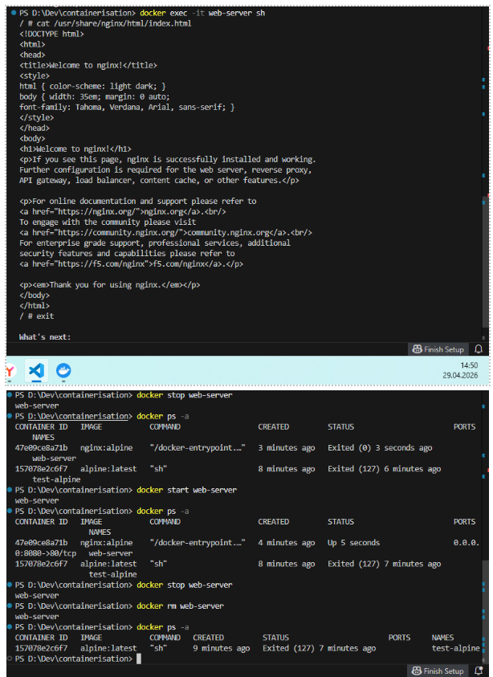
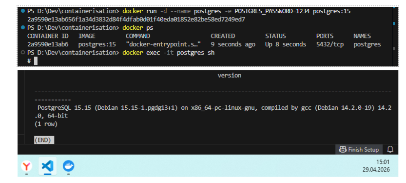
#### 1.3 Работа с томами
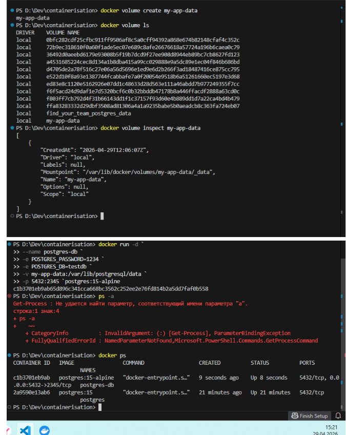
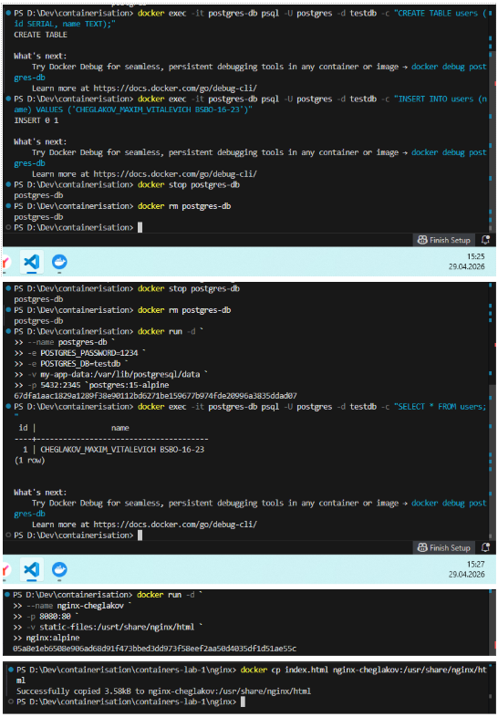
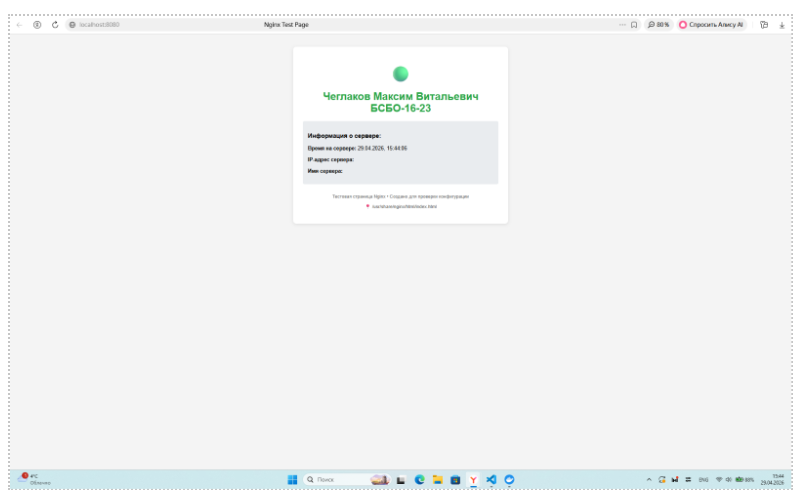
### 2. Скриншоты работающего приложения
#### 2.1 Главная страница
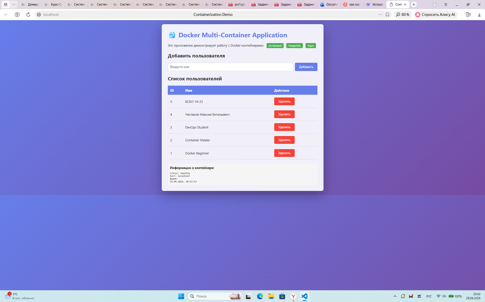
#### 2.2 Список пользователей в БД
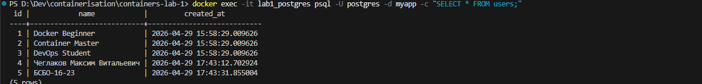
### 3. GitHub Actions
#### 3.1 Успешный запуск workflow
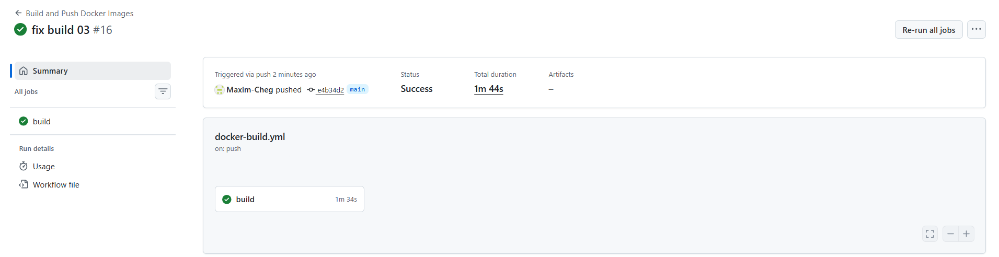
#### 3.2 Опубликованные образы в GHCR
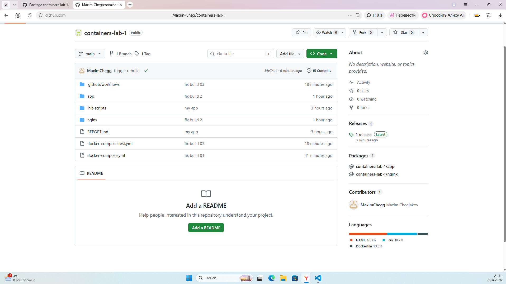
### 4. Выводы
Узнал, как публиковать пакеты и настраивать сборку github actions