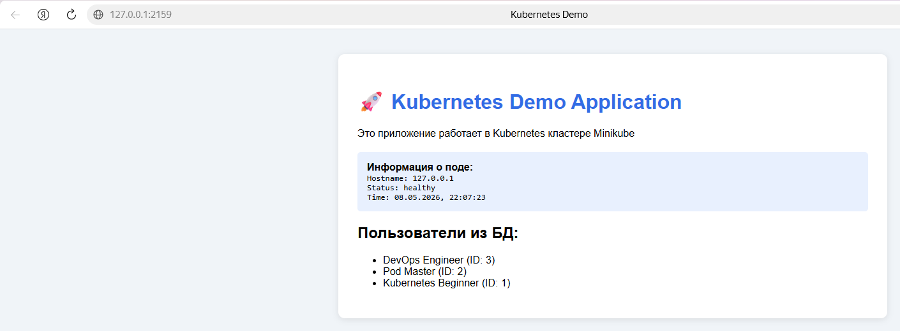
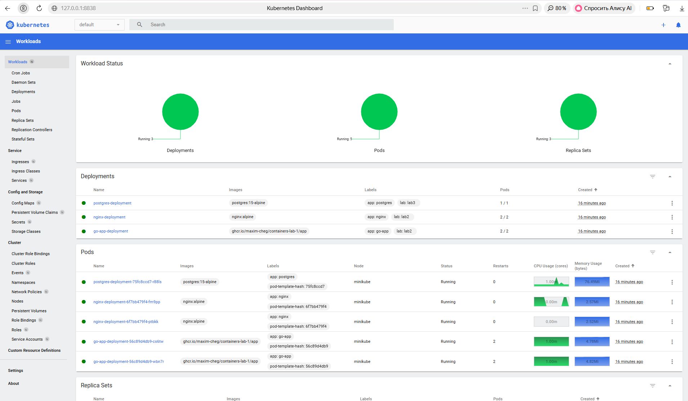
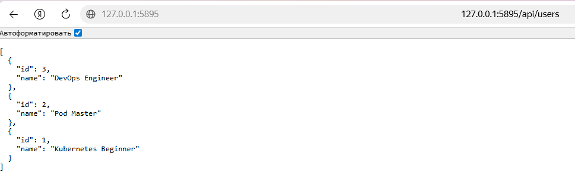

### 1. Информация о кластере
#### 1.1 Статус Minikube
\`\`\`
PS D:\Dev\containerisation\containers-lab-1\k8s> minikube status
minikube
type: Control Plane
host: Running
kubelet: Running
apiserver: Running
kubeconfig: Configured
\`\`\`
#### 1.2 Узлы кластера
\`\`\`
PS D:\Dev\containerisation\containers-lab-1\k8s> kubectl get nodes -o wide
NAME       STATUS   ROLES           AGE     VERSION   INTERNAL-IP    EXTERNAL-IP   OS-IMAGE                         KERNEL-VERSION                       CONTAINER-RUNTIME
minikube   Ready    control-plane   3h45m   v1.35.1   192.168.49.2   <none>        Debian GNU/Linux 12 (bookworm)   5.15.167.4-microsoft-standard-WSL2   docker://29.2.1
\`\`\`
### 2. Созданные ресурсы
#### 2.1 Pods
\`\`\`
PS D:\Dev\containerisation\containers-lab-1\k8s> kubectl get pods -o wide
NAME                                  READY   STATUS    RESTARTS      AGE   IP            NODE       NOMINATED NODE   READINESS GATES
go-app-deployment-56c89d4db9-cs6tw    1/1     Running   2 (11m ago)   12m   10.244.0.35   minikube   <none>           <none>
go-app-deployment-56c89d4db9-wbn7r    1/1     Running   2 (11m ago)   12m   10.244.0.36   minikube   <none>           <none>
nginx-deployment-6f7bb479f4-fm9pp     1/1     Running   0             11m   10.244.0.37   minikube   <none>           <none>
nginx-deployment-6f7bb479f4-ptbkk     1/1     Running   0             11m   10.244.0.38   minikube   <none>           <none>
postgres-deployment-75fc8ccd7-r88ls   1/1     Running   0             11m   10.244.0.39   minikube   <none>           <none>
\`\`\`
#### 2.2 Deployments
\`\`\`
PS D:\Dev\containerisation\containers-lab-1\k8s> kubectl get deployments
NAME                  READY   UP-TO-DATE   AVAILABLE   AGE
go-app-deployment     2/2     2            2           12m
nginx-deployment      2/2     2            2           12m
postgres-deployment   1/1     1            1           12m
\`\`\`
#### 2.3 Services
\`\`\`
PS D:\Dev\containerisation\containers-lab-1\k8s> kubectl get services
NAME               TYPE        CLUSTER-IP       EXTERNAL-IP   PORT(S)        AGE
go-app-service     ClusterIP   10.101.235.165   <none>        8080/TCP       55m
kubernetes         ClusterIP   10.96.0.1        <none>        443/TCP        3h46m
nginx-service      NodePort    10.107.230.86    <none>        80:30080/TCP   55m
postgres-service   ClusterIP   10.104.214.23    <none>        5432/TCP       55m
\`\`\`
### 3. Скриншоты работы приложения
#### 3.1 Главная страница

#### 3.2 Дашборд Kubernetes

#### 3.3 Результат GET /api/users

### 4. Эксперименты с масштабированием
#### 4.1 Масштабирование до 5 реплик
\`\`\`

\`\`\`
#### 4.2 Проверка распределения нагрузки
\`\`\`

\`\`\`
### 5. GitHub Actions
#### 5.1 Успешная валидация манифестов
